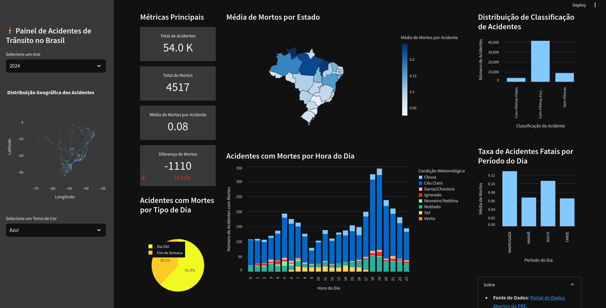

# Painel de Acidentes de Trânsito no Brasil 🚦


Este projeto é uma aplicação web moderna e interativa para visualizar e analisar dados de acidentes de trânsito ocorridos em rodovias federais brasileiras.

## Sumário

- [Descrição](#descrição)
- [Funcionalidades](#funcionalidades)
- [Arquitetura](#arquitetura)
- [Pré-requisitos](#pré-requisitos)
- [Instalação](#instalação)
- [Como Executar](#como-executar)
- [Uso](#uso)
- [Tecnologias Utilizadas](#tecnologias-utilizadas)
- [Contribuição](#contribuição)
- [Licença](#licença)

## Descrição

A aplicação permite explorar dados de acidentes de trânsito ocorridos nas rodovias federais do Brasil, fornecendo visualizações interativas e insights valiosos sobre padrões e tendências. O objetivo é conscientizar sobre os riscos no trânsito e contribuir para a redução de acidentes através da análise de dados.

## Funcionalidades

- **Dashboard Interativo:** Visão geral dos acidentes com métricas principais e filtros
- **Mapa de Acidentes:** Visualização geoespacial com mapa de calor e marcadores
- **Análises Detalhadas:** Gráficos e estatísticas por causa, tipo, hora do dia e condições
- **Perfil de Risco:** Calculadora de risco baseada em fatores como rodovia, horário e condições
- **Previsões:** Modelos preditivos para identificar tendências futuras
- **Recomendações:** Sugestões de segurança personalizadas por perfil

## Arquitetura

O projeto segue uma arquitetura moderna dividida em:

### Backend (Python/FastAPI)
- API RESTful para acesso aos dados e modelos
- Processamento de dados com Pandas e NumPy
- Modelos estatísticos e preditivos

### Frontend (Next.js/React)
- Interface responsiva e moderna
- Visualizações interativas com Leaflet e Chart.js
- Filtros dinâmicos e personalizáveis

## Pré-requisitos

- Node.js (v16+) para o frontend
- Python 3.9+ para o backend
- PostgreSQL (opcional para desenvolvimento local)
- Gerenciadores de pacotes `pip` e `npm`

## Instalação

1. **Clone o repositório:**

   ```bash
   git clone https://github.com/seu-usuario/prf-acidentes-dashboard.git
   cd prf-acidentes-dashboard
   ```

2. **Configurar e instalar o backend:**
   ```bash
   cd backend
   python -m venv venv
   source venv/bin/activate  # No Windows: venv\Scripts\activate
   
   # Instalação de dependências
   pip install -r requirements.txt
   
   # Baixar e processar dados (opcional se já tiver os dados)
   python data_ingestionall.py
   ```

3. **Configurar e instalar o frontend:**
   ```bash
   cd frontend
   npm install
   # ou com yarn
   yarn install
   ```

## Como Executar

### Backend
```bash
cd backend
python run.py
# O servidor estará disponível em http://localhost:8000
```

### Frontend
```bash
cd frontend
npm run dev
# ou com yarn
yarn dev
# O site estará disponível em http://localhost:3000
```

### Acesso à API
A documentação da API estará disponível em:
- http://localhost:8000/docs (Swagger UI)
- http://localhost:8000/redoc (ReDoc)

## Uso

- Explore o dashboard principal para obter uma visão geral dos acidentes
- Use os filtros para refinar os dados por ano, estado, causa e tipo
- Interaja com o mapa para visualizar a distribuição geográfica dos acidentes
- Consulte as análises detalhadas para compreender padrões e tendências
- Utilize a calculadora de risco para avaliar o perfil de segurança de rotas específicas
- Examine as previsões para antecipar tendências futuras

## Tecnologias Utilizadas

### Backend
- [FastAPI](https://fastapi.tiangolo.com/): Framework moderno e rápido para APIs
- [Pandas](https://pandas.pydata.org/): Manipulação e análise de dados
- [NumPy](https://numpy.org/): Computação numérica
- [scikit-learn](https://scikit-learn.org/): Modelos de machine learning
- [SQLAlchemy](https://www.sqlalchemy.org/): ORM para banco de dados

### Frontend
- [Next.js](https://nextjs.org/): Framework React para aplicações web
- [React](https://reactjs.org/): Biblioteca para interfaces de usuário
- [Material UI](https://mui.com/): Componentes React de design
- [Leaflet](https://leafletjs.com/): Mapas interativos
- [Chart.js](https://www.chartjs.org/): Gráficos dinâmicos
- [TailwindCSS](https://tailwindcss.com/): Estilização utilitária

## Contribuição
Contribuições são bem-vindas! Por favor, sinta-se à vontade para enviar um Pull Request.

## Contato

##### Pedro Henrique Arias Oliveira: 
<p align="center"> 
  <a href="https://www.linkedin.com/in/pedroarias92/" target="blank">
    
  </a> 
  <a href="mailto:pedro.oliveira@sistemafiep.org.br" target="blank">
    
  </a>
</p>